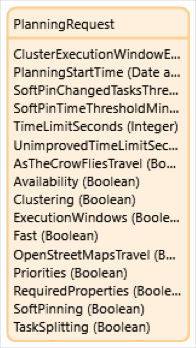
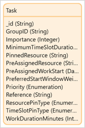
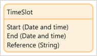
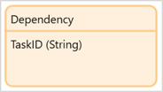
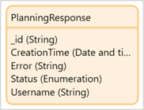
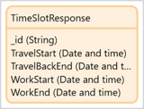
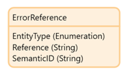

## 1 Introduction

{}[Add the link to the marketplace page after the component is released]{}

Powered by AI, the [Automated Task & Resource Planner]() app service is capable of solving complex planning cases and automatically creating the most efficient planning based on the available resources. The planner matches tasks with resources, taking a wide range of constraints into account. 

The app service has a module containing a plug-and-play integration with the Automated Task & Resource Planner API.

### 1.1 Typical Use Cases

You can use this app service when you want to automatically schedule tasks in your Mendix application.

### 1.2 Features

*	Scheduling tasks
*	Priority tasks
*	Travel time
*	Required skills/properties
*	Time windows
*	Overtime
*	Rosters

### 1.3 Prerequisites

*	You have an Automated Task & Resource Planner account
{}[how to set up the account?]{}

### 1.4 Dependencies
* Community Commons Function Library
* Encryption

### 1.5 Demo App
To see how the app service can be used and implemented in a Mendix project, check out the following demo apps for different industries:

* Delivery Planning: Coffee Hardware delivers various office coffee machines to different customers within the Netherlands. They use the Automated Task & Resource Planner to generate the most efficient daily routes for their drivers to deliver the orders to the customer. The planning is shown in different ways: the route per driver and a calendar overview.
* Call Scheduling: Customers of Sky Bank have filled out an online contact form with a callback request. They indicated that their question is about opening accounts, stocks, mortgages or money transfers. They can also indicate their preferred language. The Automated Task & Resource Planner is used to schedule the calls as efficiently as possible based on availability of the call center agents and preferences of the customer. The Planner takes into account that the agents work either a morning or afternoon shift and that calls concerning mortgages and stocks are expected to last 60 minutes and calls regarding the other two subjects 30 minutes.
* Matching Planning: Simply Smashing has several tennis courts available for club members to enjoy a game of tennis. The Automated Task & Resource Planner takes the available time slots of 60 minutes, requested tennis court types, opening times and priority level of a match into account when creating the schedule. When the “human” planner would like to manually plan a match, the request can be selected and the available time slots and tennis court that meet the requirements are shown in green. It is possible to manually set the time slot or specific court so the Planner will make sure these appointments are taken into account.
* Maintenance and Repair: Ofixed has a workforce of skilled mechanics to meet the maintenance and repair needs of their customers. The Automated Task & Resource Planner matches the mechanics with the right skills to complete the customer's service request and schedule the appointments. In doing so the Planner is taking a wide range of constraints into account, such as deadlines, customer preferred time windows, roster of the mechanics, overtime, dependencies between work orders, preceding service requests, office opening hours and priorities. Service requests that span over multiple days will be automatically split into multiple appointments. The ‘human’ planner is able to manually plan or alter existing appointments and secure (pin) mechanics or time.

{}[Provide a link to a maintained demo app where the component is used if available]{}

## 2 Installation

To configure this module, follow these steps:

1. Follow the instructions in [How to Use Marketplace Content in Studio Pro](/appstore/general/app-store-content) to import these two components into your applications into your application:

     * [Community Commons Function Library](https://marketplace.mendix.com/link/component/170) 

     * [Encryption](https://marketplace.mendix.com/link/component/1011) module
     
2. [Configure](/appstore/modules/encryption) the Encryption module.
3. Add the `Settings_Snippet` and `Log_Snippet` to a custom page in a different module. {}[Where can you find these?]{}
4. After the deployment, go to the **Settings** page and enter the **Automated planning endpoint**, **username**, and **password**.

     {}[how to get to the **Settings** page? Where to get username and password?]{}

## 3 Configuration

## 4 Usage

### 4.1 Build the request

You can build the request using the entities from the module. You can find examples on how to build the request in the example app from the Marketplace. Below you can find a description of all the entities and attributes.

#### 4.1.1 `PlanningSetting`

This is the settings for this planning. Create the object and associate it to `PlanningRequest`. This object is required for the `PlanningRequest`.

| Attribute | Type | Description |
| --------- |--------|--------|
| `ClusterExecutionWindowExclusionDays` | Integer | Only affects the `CLUSTERED` planning type. Defines a period in days since planningStart in which tasks will be clustered separately. All tasks for which the last service window ends inside this period, will be clustered with other tasks with the same service window. If set to `0`, no service windows are treated in a special way. |
| `PlanningStartTime`   | Date and time | The time from when you start planning. |
| `SoftPinChangedTasksThreshold ` | Integer | The maximum number of allowed changed soft pinned tasks. |
| `SoftPinTimeThresholdMinutes	` | Integer | The maximum duration in minutes that a soft pinned task's start or end time can change before the task is considered changed. If set to `0`, all changes are considered a change and new tasks are usually added to the end of the work queue. |
| `TimeLimitSeconds` | Integer | The maximum time in seconds that the planner can spend without improving the planning. If the planning does not improve for for the specified amount of time the planner will finish early. If left empty, a configured default will be used. |
| `UnimprovedTimeLimitSeconds` | Integer | The maximum time in seconds that the planner can spend without improving the planning. If the planning does not improve for for the specified amount of time the planner will finish early. If left empty, a configured default will be used. |
| `AsTheCrowFliesTravel` | Boolean | Enables using haversine distance to find travel time. |
| `Availability` | Boolean | Enables availability windows. Availability windows are times when a resource is available to work. It represents the workday, but holidays, weekends, and sick days should also be taken into account for this.{}check the description{} |
| `Clustering`   | Boolean | This is an option if the solver type `Fast`is still not fast enough, and locations tend to be clustered geographically, for example, in cities and towns. `Clustering` greatly reduces the total number of locations that need to be solved per planning, which in turn makes the total runtime a lot smaller. |
| `ExecutionWindows`  | Boolean | Enables execution windows. Execution windows are times when a task can be picked up, outside these windows, it is impossible to work for some reasons, for example, because the location is closed.{}check the description{} |
| `Fast`  | Boolean | When the value is `true` the solver type is `Fast`. `Fast` contains a very limited subset of rules. It only deals with travel duration and work duration, and does not deal with anything that requires exact time, such as dependencies, pinning tasks, and multi-mechanic tasks. With the approach, the application does not need to check for dependencies or linked tasks, and a change in the beginning of the chain does not affect all the tasks that come after. In this way, the approach is much faster than `Full`. |
| `OpenStreetMapsTravel` | Boolean | Enables Graphhopper (OpenStreetMaps) service to find the travel time |
| `Priorities` | Boolean | Enables using `priorities`. Some tasks may need to be assigned as early as possible, regardless of the travel time. The planner allows setting `Medium` and `High` priorities for this purpose. |
| `RequiredProperties`  | Boolean | Enables using required properties. Some tasks might have requirements. Requirements can be certifications, having a key, or even types of resources. For example, a leak can require a  certified plumber, and a dig site can require an excavator. |
| `SoftPinning` | Boolean | Enables soft pinning. A human planner is always able to override the planning suggested by the field service planner application. The human planner can pin tasks to a  pre-specified mechanic, a pre-specified time, or a combination of both. There are different types of pins, 'hard' pins are always followed by the planner, while 'soft' pins are followed by the application as much as possible, but if the situation requires a change, for example, if a higher priority task comes in, then the application changes the plan. |
| `TaskSplitting` | Boolean | Enables splitting a task. In some cases tasks can span multiple days. When the value is `true`, the planner automatically splits these into multiple appointments. It is also possible to specify a minimum appointment duration, so the planner does not make the task start shortly before the end of the day. When the value is `false`, the planner cannot split up a task |

#### 4.1.2 Task

A task is a unit of work. A task can be the delivery of an order, a work order task, a reservation, etc. Tasks are assigned to `Resources` and `TimeSlots`. Tasks are associated to  `PlanningRequest` and at least one task is required to make a request. 

| Attribute | Type | Description |
| --------- |--------|--------|
| `_id`  | String | The task ID. |
| `GroupID`| String | The group ID for multi-resource tasks. All partial tasks in the same multi-resource task must have the same group ID. |
| `Importance` |Integer| Shows how important this task is compared to others. If the planning has to choose a task to drop because there is not enough time to pick up all tasks, more important tasks are preferred over less important ones. Use priority or execution windows if the planner should plan certain tasks before others. The default value is `1`. |
| `MinimumTimeSlotDurationMinutes` | Integer | Example: 60 Used for Task splitting. If a task is split into multiple timeSlots, this value indicates the minimum duration that each time slot must be, in minutes. If this value is equal to `workDurationMinutes`, the planner will not split the task. Defaults to `workDurationMinutes`, if not set. |
| `PinnedResource` | String | The resource ID for the pinned resource. Set this value only if `resourcePinType` is `SOFT` or `HARD`. |
| `PreAssignedResource` | String | The ID of the resource that this task is assigned to. If the value is empty, the task starts without being unassigned to a resource. |
| `PreAssignedWorkStart` | Date and time | The pre-planned timeSlots. You cans set this to assigned tasks if `pinnedTimeSlots` is `false`, but it is not required. Setting it may improve performance on re-calculations. You should not set it on unassigned tasks. |
| `PreferredStartWindowWeight` | {}[Type?]{} | The weight of the` preferredStartWindows` compared to minutes of travel time. For example, if the `preferredStartWindowWeight` is `30`,  then the planner allows up to 30 minutes of extra travel time across all resources, to create the `preferredStartWindows`. {}check the description{} |
| `Priority` | Enumeration | Shows how quickly this task needs to be picked up. `MEDIUM` and `HIGH` priority tasks are planned as soon as possible, possibly at the cost of total travel time. `HIGH` priority tasks are planned before `MEDIUM` priority tasks if possible. `LOW` priority tasks are planned as cheaply as possible. The optimizer minimizes total travel and work time, even if this means that tasks will be done later. `ExecutionWindows` is always considered. A `LOW` priority task may be assigned earlier than a high priority task if its execution window ends earlier. Use `Importance` if the planner must decide which task should be picked up, if there is not enough time to pick them all up. {}Why "cheaply"?{} |
| `Reference` | String | Reference which can be used by the client to map error messages to  client side entities. Not used by the planner other than validations. |
| `ResourcePinType` | Enumeration | The pin type. If set to `HARD`,  the planner will never change this resource assignment. If set to `SOFT`, the  planner will only change the assignment if other tasks would be dropped. |
| `TimeSlotPinType` | Enumeration | The pin type. If set to `HARD`, the planner will never change this time  slot assignment. If set to `SOFT`, the planner will only change the assignment  if other tasks would be dropped. |
| `WorkDurationMinutes` | Integer | The expected work duration in  minutes. Must be set if `TimeSlotPinType` is `NON`. |

 

#### 4.1.3 Resource

A resource in a planning request. This can be a mechanic, a tennis court, a delivery driver, etc. At least one resource is required to make a request.

| Attribute | Type | Description |
| --------- |--------|--------|
| `_id`   | String | The resource ID. |
| `MaxOvertimeMinutes` | Integer | The maximum overtime in minutes that the resource can make. Overtime is only used to finish a task. New tasks are not started within this time. |
| `Reference`  | String | The reference which can be used by the client to map error messages to client-side entities. Not used by the planner other than validations. |

#### 4.1.4 Property

Properties are used to restrict the tasks that a resource can pick up. A resource needs to have the required properties to pick up a task. Properties are required if the `RequiredProperties` setting is set to `true`. 

| Attribute | Type | Description |
| --------- |--------|--------|
| `Value`   | String | String that needs to match for the `RequiredProperty` and the `ResourceProperty`: <ul><li>`RequiredProperty`: The set properties on the resource that are required to fix a task.</li> <li>`ResourceProperty`: The properties that the resource possesses to pick up tasks.</li></ul> |

#### 4.1.5 Location

A location with ID and coordinates. A location can be the following:  {}check the format of the text – should it be formatted as code?{}

●   TaskLocation: location of the task

●   CurrentLocation: Current location of the resource

●   DefaultLocation: Default location of the resource (where the resource starts and ends the day)

Locations are optional, but if used, they need to be added to all the tasks and resources.

| Attribute | Type | Description |
| --------- |--------|--------|
| `Latitude` | Decimal | The latitude of the location.|
| `Longitude`  | Decimal | The longitude of the location.|
| `Reference`  | String | Reference which can be used by the client to map error messages to client side entities. Not used by the planner other than validations. |

#### 4.1.6 TimeSlot

`TimeSlot` is a time interval. Is used for:

●   *PinnedTimeslots*: Must only be set if `resourcePinType` is `SOFT` or `HARD`.

●   *PreferredStartWindow*: A list of preferred windows when the task should start. No guarantee can be given that the task will be picked up within any of these windows. The importance of keeping to these windows is set by `preferredStartWindowWeight`

●   *ExecutionWindow*: A list of windows when the task can be picked up. This usually relates to when a location is accessible. Service windows must be given if `pinnedTimeSlots` is `false`.

●   *Availability*: A list of times where the resource is available

| Attribute | Type | Description |
| --------- |--------|--------|
| `Start` | Date and time | The start of the interval|
| `End`   | Date and time | The end of the interval|
| `Reference`  | String | Reference which can be used by the client to map error messages to client side entities. Not used by the  planner other than validations. |

#### 4.1.7 Dependency

A list of task ids that must finish before starting the current task.

| Attribute | Type | Description |
| --------- |--------|--------|
| `TaskID` | String | The ID of the task that must finish before the current task. |

### 4.2 Response

If the response went well you can retrieve the TaskResponse and map the results to your own entities.

#### 4.2.1 PlanningResponse

The solution to the planning request. 

| Attribute | Type | Description |
| --------- |--------|--------|
| `_id`   | String | The ID of the planning response.|
| `CreationTime` | Date and time | Time when the planning was created.|
| `Error` | String | An error message if an exception occurred during execution. |
| `Status` | Enumeration | Execution status.|
| `Username`  | String | Username of the user that created the planning. |

#### 4.2.2 TaskResponse

A task in a planning response.

| Attribute | Type | Description |
| --------- |--------|--------|
| `_id`   | String | The task ID.  |
| `AssignedResourceID` | String | The ID of the resource to which this task has been assigned. |

#### 4.2.3 TimeSlotResponse

| Attribute | Type | Description |
| --------- |--------|--------|
| `_id`  | String | The ID of the the time slot response.  |
| `TravelStart`   | Date and time | When the resource starts travelling.   |
| `TravelBackEnd` | Date and time | When the resource finishes traveling to the default location. The value is `null` if this is not the last task of the day. |
| `WorkStart`     | Date and time | When the resource starts working.  |
| `WorkEnd`       | Date and time | When the resource finishes working. |

#### 4.2.4 Warning

`Warning` contains a list of warnings for this task. The possible values are described in the table:

| Attribute | Type | Description |
| --------- |--------|--------|
| `Value`   | Enumeration | The value can be the following: <ul><li>  `MISSING_REQUIRED_PROPERTIES` </li> <li>`NO_TIME_SLOTS_PLANNED`</li><li>`NO_VALID_TIME_FOUND`</li><li>`OUTSIDE_EXECUTION_WINDOW`</li><li> `OVERLAP`</li><li> `RESOURCE_MISMATCH`</li><li> `RESOURCE_NOT_AVAILABLE`</li><li> `SOFT_PINNED_RESOURCES_CHANGED`</li><li> `SOFT_PINNED_TIME_SLOTS_CHANGED`</li> </ul> |

#### 4.2.5 ValidationError

Error information

| Attribute | Type | Description |
| ------------- |------------|--------|
| `ErrorCode`    |  | Enumeration | A machine readable error code. |
| `ErrorMessage` |  | String | A human readable error code.   |

#### 4.2.6 ErrorReference

Points to the object which caused the validation error. This can either be the source of the error or the target.

| Attribute | Type | Description |
| ------------- |------------|--------|
| `EntityType`  | Enumeration |  The entity type of the object that is referred to.           |
| `Reference`   | String |  The `reference` string that was on the object that is referred to. |
| `SemanticID`  | String |  The ID known to the planner. For tasks, this is the task ID. For availability, this is a time window. |

To see an example about on how to use the module, check out the demo.

Various API requests, request parameters, possible responses include the potential error scenarios. This should be from a technical perspective (what is needed for the request) as well as from a functional perspective (when and why to execute which requests and how to interpret the results)

## 5 Troubleshooting

When there are problems, check the logs that are stored in the application. This is the easiest way to troubleshoot. You can access the logs by connecting `SolutionLog_Overview` to your navigation. The log shows you the request and response from the service and any errors that have occurred.

{}[How to do this exactly?]{}

## 6 Read More

[Swagger documentation](https://saas-acceptance.timeseries.com/swagger-ui/?urls.primaryName=field-service-planner)
