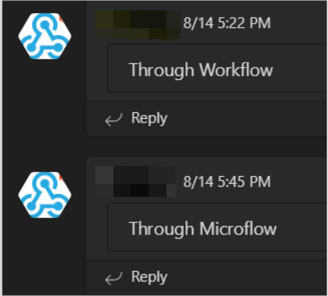
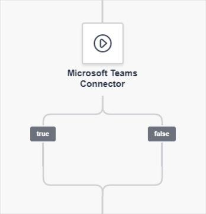
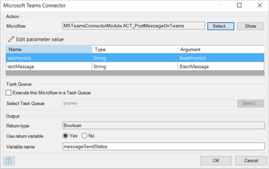
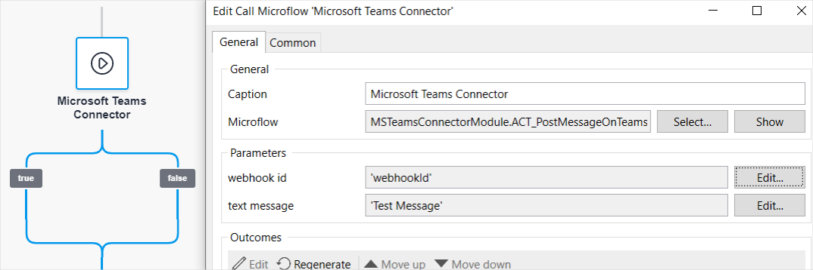

## 1 Introduction

{}[**Verify Marketplace Docs tabs**]{}

The [Microsoft Teams Connector](https://marketplace.mendix.com/link/component/118391) app service is a module that enables sending messages to a Microsoft Teams channel.

### 1.1 Typical Use Cases

*  You can configure Microsoft Teams Connector in a microflow.
   
   
*  It can also be used in a [workflow](/refguide/workflows).
   

### 1.2 Limitations

* Currently, only text messages are supported

### 1.3 Prerequisites

The app service can only be used with Studio Pro 9 versions starting from [9.8](https://docs.mendix.com/releasenotes/studio-pro/9.8).

## 2 Installation

1. Go to the Marketplace and download the *MSTeamsConnectorModule.mxmodule* file for the [Microsoft Teams Connector](https://marketplace.mendix.com/link/component/118391).

2.  To add the Microsoft Teams Connector to your app in Mendix Studio Pro, follow these steps:
    1. In the tool bar,click **App** and select **Show App Directory in Explorer**.
    
    2. Check if a folder with name **modules** is present in the directory. If not present, create a new folder with that name.
         
    
    3. Copy the downloaded mxmodule file in the modules folder.
    
    4. Again click on **App** in tool bar and select **Synchronize App Directory**.
    
    5. Check the App Explorer to view a module with name **Protected modules**. Collapse the Protected modules folder to see the Microsoft Teams Connector module.
         
         
         {} you cannot have different versions of the Microsoft Teams Connector in your project at the same time.{}
         

Once imported, the app service is visible in the **App Explorer** under **Protected modules** and in the **Communication Services** category in the **Toolbox**. 

## 3 Configuration

Microsoft Teams Connector is a premium Mendix product that is subject to a purchase and subscription fee. To successfully deploy an app that uses Microsoft Teams Connector, you need to get a valid combination of **LicenseSecret** and **LicenseKey** and configure them as environment variables in the deployment setting.

### 3.1  Subscribing to Get LicenseSecret and LicenseKey {#key-generation}

1. On the [Microsoft Teams Connector](https://marketplace.mendix.com/link/component/118391) page, click **Subscribe** to start a subscription or click **Try for Free** to start a trial.

2.  To start a subscription, fill in [Technical Contact](https://docs.mendix.com/developerportal/collaborate/app-roles#technical-contact) information (**First Name**, **Last Name**, **Email Address**), billing account information, and other required information and then place the order. The Technical Contact receives an order confirmation email. 

    For the trial, you do not need to fill in this information.

3. Click the link in the order confirmation email to go to the Marketplace [Subscriptions](/appstore/general/app-store-overview#subscriptions) page and log in there. The **Subscriptions** page gives an overview of all the subscriptions of your organization.

4. Click **Microsoft Teams Connector** to open the [service management dashboard](/appstore/general/app-store-overview#service-management-dashboard).

5. Click **Create Binding Keys**.

6. Enter a meaningful name for the binding keys. Make sure that the name includes the name of the app which uses Microsoft Teams Connector.

7.  Click **Create Keys** to get the system generated **LicenseSecret** and **LicenseKey**. 
    

8. **Copy** the **LicenseSecret** and **LicenseKey**. You will use them later for app deployment.

### 3.2 Configuring LicenseSecret and LicenseKey for App Deployment

1.  In the **App Explorer**,collapse first module to open App settings.In the App Settings popup, go to **Configurations**.

2.  Select your active configuration and click on edit.

3.  In the Edit Configuration popup, click on **Constants**.

4.  Click **New** and navigate to the **Configurations** folder inside MSTeamsConnectorModule.You can see **LicenseSecret** and **LicenseKey** are defined as constants. 
    

5. Double-click **LicenseSecret** and enter the **LicenseSecret** that you got.

6. Click **OK** to save the settings.

7. Follow the same steps to set the value of **LicenseKey**.

8. After you finish building the app, click **Run** to deploy your app to the cloud.

## 4 Usage

### 4.1 Configuring Webhooks in Communication Services Console  
  In Microsoft Teams, [create a webhook URL for the channel](https://docs.servicenow.com/bundle/quebec-it-service-management/page/product/site-reliability-ops/task/create-webhook-url-channel-ms-teams.html) to which you want to send message.
{}Configuring Webhooks in communication console will be added once entire flow is ready{}

### 4.2 Sending Message to a teams channel

#### 4.2.1 Using Microflow

1. From the toolbox, drag and drop the Microsoft Teams Connector activity in your microflow. 
          
2. To configure the activity, double-click the activity and specify the following settings in the **Microsoft Teams Connector** dialog box with expression syntax

3. Set the **webhookId** parameter to the **webhookId** generated for the Microsoft Teams channel webhookUrl you configured in Communication Services Console.

4. Set the text message parameter with the message you want to send on the channel.
    

5. Click **OK** to save the changes and close the window.    
   {}The activity returns a boolean value true if message gets sent successfully else false.{}
   
   After the **Microsoft Teams Connector** activity is configured, once the microflow that uses this activity is triggered, the app asynchronously sends out the message to the microsoft teams channel.
   
#### 4.2.1 Using Workflow   

1. From the toolbox, drag and drop the **Call microflow** activity in your workflow.    
2. Double click on this activity and in the **Edit Call Microflow** popup, click on select for microflow.
3. In the **Select Microflow** popup, Go to  Protected modules -> MSTeamsConnectorModule -> USE_ME and select **ACT_PostMessageOnTeams** microflow.
4. Click on select to close the popup.
5. Now in the **Edit Call Microflow** popup, configure the webhook id and text message parameters with expression syntax.
.
5. Click **OK** to save the changes and close the window.    
   {}The miroflow returns a boolean value true if message gets sent successfully else false.{}
   
   After the **ACT_PostMessageOnTeams** microflow is configured, once the workflow that uses this microflow is triggered, the app asynchronously sends out the message to the microsoft teams channel.

     
### 5 Checking Statistics Using the Usage Dashboard
{}Will add content once  available{}
