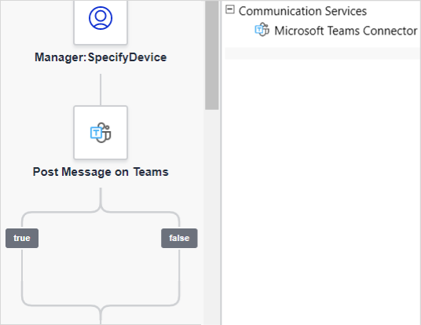

## 1 Introduction

{}[**Verify Marketplace Docs tabs**]{}

[Microsoft Teams Connector](https://marketplace.mendix.com/link/component/118391) enables including MS teams component in your Mendix application. Just add the minimum required configuration and you are good to go. 

The app service works with [Mendix SSO](/appstore/modules/mendix-sso), so no additional authentication changes are required.

### 1.1 Typical Use Cases

*  You can configure Microsoft Teams Connector in any of your microflow.

   

*  It can also be used in a [workflow](/refguide/workflows)

   

### 1.2 Limitations

* Currently, only text messages are supported

### 1.3 Prerequisites

The app service can only be used with Studio Pro 9 versions starting from [9.8](https://docs.mendix.com/releasenotes/studio-pro/9.8).

## 2 Installation

1. Follow the instructions in [How to Use Marketplace Content in Studio Pro](/appstore/general/app-store-content) to import the component into your application.

2. In the **Toolbox**, drag the **Microsoft Teams Connector** activity into your microflow or workflow.

   {}[**validate the workflow part in the second step**]{}

## 3 Configuration

1. In Microsoft Teams, [create a webhook URL for the channel](https://docs.servicenow.com/bundle/quebec-it-service-management/page/product/site-reliability-ops/task/create-webhook-url-channel-ms-teams.html).

2. In Studio Pro, click the **Microsoft Teams Connector** activity that is used in a microflow or workflow to configure it.

   {}[**check how to set the arguments**]{}

3. Set the Microsoft Teams channel webhookId (**webhookId** is the unique id generated for added webhookUrl in console).

4. Set the text message to post on the channel.

   

5. Click **OK** to save the changes and close the window.
