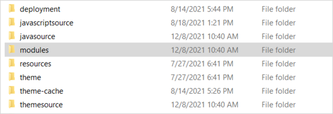

## 1 Introduction

{}[**Verify Marketplace Docs tabs**]{}

The [Microsoft Teams Connector](https://marketplace.mendix.com/link/component/118391) app service enables sending messages to a Microsoft Teams channel automatically. You can add and configure the app service in a microflow. Once the microflow that uses the app service is triggered, your app asynchronously sends out the message to the Microsoft Teams channel. 

### 1.1 Typical Use Cases

*  Support sending messages to a Microsoft Teams channel automatically

### 1.2 Limitations

* Currently, only text messages are supported

### 1.3 Prerequisites

The app service can only be used with Studio Pro 9 versions starting from [9.8](https://docs.mendix.com/releasenotes/studio-pro/9.8).

## 2 Installation

1. Go to the Marketplace and download the file *MSTeamsConnectorModule.mxmodule* for the [Microsoft Teams Connector](https://marketplace.mendix.com/link/component/118391).

2.  To add the Microsoft Teams Connector to your app in Mendix Studio Pro, follow these steps:
    1. On the menu bar, go to **App** > **Show App Directory in Explorer**.
    
    2.  Check if a folder with the name **modules** is present in the directory. If not present, create a new folder with this name.
        
        
    3.  Copy the downloaded file *MSTeamsConnectorModule.mxmodule*  in the **modules** folder. 
       
       {} you cannot have different versions of the Microsoft Teams Connector in your app at the same time.{}
    
    4. In Studio Pro, go to **App** > **Synchronize App Directory**. 
    

After the synchronization is finished, you can find the app service in the **Protected modules** folder in the **App Explorer** and in the **Communication Services** category in the **Toolbox**. 

## 3 Configuration

Microsoft Teams Connector is a premium Mendix product that is subject to a purchase and subscription fee. To successfully deploy an app that uses Microsoft Teams Connector, you need to get a valid combination of **LicenseSecret** and **LicenseKey** and configure them as environment variables in the deployment setting.

### 3.1  Subscribing to Get LicenseSecret and LicenseKey {#key-generation}

1. On the [Microsoft Teams Connector](https://marketplace.mendix.com/link/component/118391) page, click **Subscribe** to start a subscription or click **Try for Free** to start a trial.
2.  To start a subscription, fill in [Technical Contact](https://docs.mendix.com/developerportal/collaborate/app-roles#technical-contact) information (**First Name**, **Last Name**, **Email Address**), billing account information, and other required information and then place the order. The Technical Contact receives an order confirmation email. 

    For the trial, you do not need to fill in this information.

3. Click the link in the order confirmation email to go to the Marketplace [Subscriptions](/appstore/general/app-store-overview#subscriptions) page and log in there. The **Subscriptions** page gives an overview of all the subscriptions of your organization.
4. Click **Microsoft Teams Connector** to open the [service management dashboard](/appstore/general/app-store-overview#service-management-dashboard).
5. Click **Create Binding Keys**.
6. Enter a meaningful name for the binding keys. Make sure that the name includes the name of the app which uses Microsoft Teams Connector.

7.  Click **Create Keys** to generate the **LicenseSecret** and **LicenseKey**. 
    

8. **Copy** the **LicenseSecret** and **LicenseKey**. You will use them later for app deployment.

### 3.2 Configuring LicenseSecret and LicenseKey for App Deployment

1.  In the **App Explorer**, go to **Settings**. The **App Settings** dialog box opens. 
2.  On the **Configurations**, click **Edit**. The **Edit Configuration** dialog box opens.
3.  Go to the **Constants** tab.
3.  Click **New**. The **Select Constant** dialog box opens.
4.  Go to **MSTeamsConnectorModule** > **Configurations**. You can see **LicenseSecret** and **LicenseKey** are defined as constants. 
    
5.  Select **LicenseSecret**.
5.  In the **New Constant Value** dialog box, enter the **Value** of the LicenseSecret you got.
5.  Click **OK** to save the settings and closes the dialog box.
7.  Do steps 4 to 5 again.
7.  Select **LicenseKey**.
7.  In the **New Constant Value** dialog box, enter the **Value** of the LicenseKey that you got.
7.  Click **OK** to save the settings and closes the dialog box.
8. After you finish building the app, click **Run** to deploy your app to the cloud.

## 4 Usage

### 4.1 Configuring Webhooks in the Communication Services Console 
 In Microsoft Teams, [create a webhook URL for the channel](https://docs.servicenow.com/bundle/quebec-it-service-management/page/product/site-reliability-ops/task/create-webhook-url-channel-ms-teams.html) to which you want to send messages.
{}Configuring Webhooks in communication console will be added once entire flow is ready{}

### 4.2 Sending Message to a Teams Channel

#### 4.2.1 Using Microflow

1.  From the toolbox, drag and drop the **Microsoft Teams Connector** activity in your microflow. 
         
2.  Double-click the **Microsoft Teams Connector** activity to open the **Microsoft Teams Connector** dialog box.
3.  Specify the following settings with expression syntax:
    1.  Set the **webhookId** parameter to the **webhookId** generated when you configured the webhook URL in the Communication Services Console.
    2.  Set the text message parameter with the message you want to send to the Microsoft Teams channel.
        
    3. Click **OK** to save the changes and close the dialog box.

{}If the message gets sent successfully, the activity returns a boolean value `true`; otherwise, the active returns `false`.{}

After the **Microsoft Teams Connector** activity is configured, once the microflow that uses this activity is triggered, the app asynchronously sends out the message to the Microsoft Teams channel.

### 5 Checking Statistics Using the Usage Dashboard
{}Will add content once  available{}
