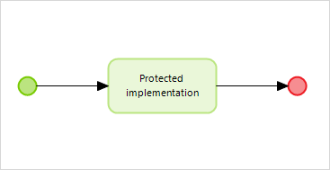

## 1 Introduction

An **add-on** module is a special kind of the Marketplace module that adds functionality to your app. 

Add-on modules may have Intellectual Property (IP) protection enabled and have an extension `.mxmodule`. For more information on IP protection, see [IP Protection](/appstore/creating-content/sol-ip-protection). 

An example of the add-on module is the **MS Teams Connector** module. {}[Add a link to the MS Teams Connector document.]{} 

When you download it, it shows up in a new **Add-ons** folder in the App Explorer. The main difference of the add-on module is that some functionality and elements, such as microflows and entities, are protected and, therefore, *hidden* from other users by the publisher. This means that you cannot see how the microflow is built, but you are able to use it in your app, for example, you can call the microflow with protected implementation from another microflow:

You also might not see the full domain model of the module, but entities, attributes, and associations that were specifically exposed by the published. 

{}

Mendix Studio does not support add-on modules, you will not be able to open the app that uses them in Studio.

{}

## 2 Importing an Add-On Module to Your App

For information on how to import a module in your app, see the [Adding a Module](/appstore/app-store-content#add-module) section in *Use Marketplace Content in Studio Pro*.

{}[Double-check which import option to leave.]{} 

To import an add-on module, do the following:

1. Download the add-on module from the Marketplace.
2. Open the app in Studio Pro where you would like to import this module.
3. Go to **File** > **Import Module Package** or right-click the app name in the App Explorer and select **Import module package**.
4. Browse to the downloaded module package and click **Open**.
5. In the **Import Module** pop-up window, select **Add as new module** in **Action**.
6. Go to **App** > **Synchronize App Directory**.

You have imported the add-on module.  

## 3 Updating an Add-On Module 

For information on how to update a module in your app, see the [Updating a Module](/appstore/app-store-content#update-module) section in *Use Marketplace Content in Studio Pro*.

## 4 Deleting an Add-On Module

To delete an add-on module, do the following:

1. Go to  **App** > **Show App Directory in Explorer** to open the app folder.
2. Browse to the **modules** folder and remove the ZIP file from there.

The module is deleted from your app.

## 5 Read More

* [IP Protection](/appstore/creating-content/sol-ip-protection)
* [Use Marketplace Content in Studio Pro](/appstore/app-store-content)

